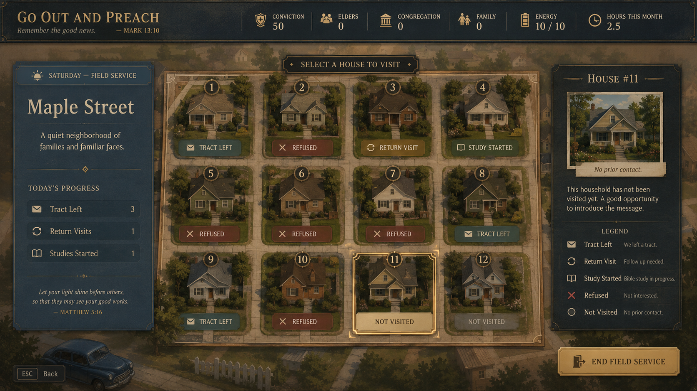
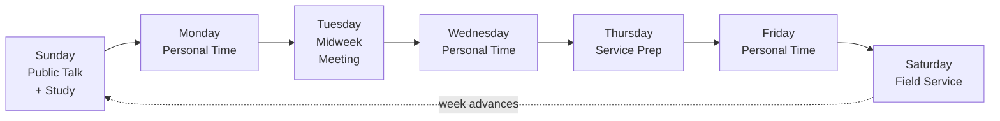
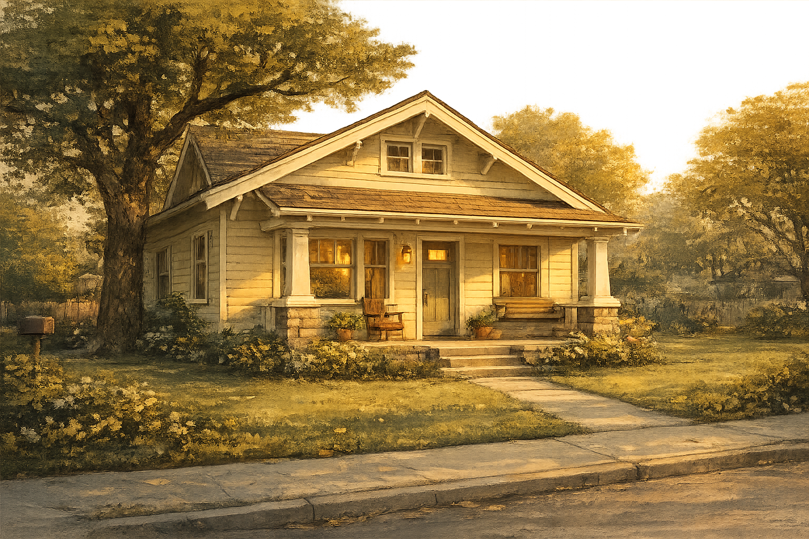
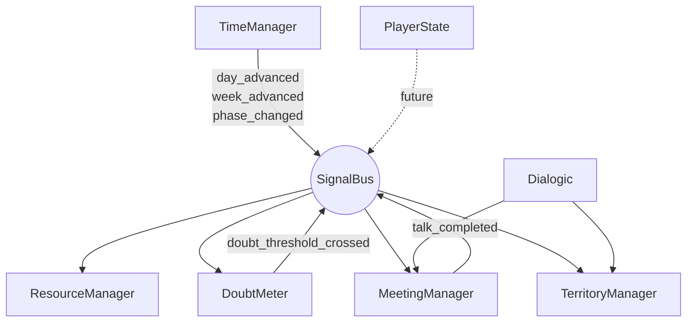

# Go Out and Preach

A narrative simulation about belief, belonging, and the quiet erosion of certainty inside a high-control millenarian Christian sect. Built in Godot 4.x.

<p align="center">
  
</p>

You play a 22-year-old publisher in **The Society of the Truth** — a fictional global sect awaiting the end of the world system. You knock doors, attend meetings at the **Hall of Witness**, manage your standing with the elders, navigate family expectations, and try to keep your faith intact as small doubts accumulate beneath the surface. Over two in-game years, a thousand small decisions quietly determine who you become.

Tone reference: *Disco Elysium* and *Pathologic*. Not satire, not horror — a slow, observational character study.

> If *Disco Elysium* is about a man losing himself in a city, this is about a person losing themselves in a system that loves them on conditions.

---

## Design Pillars

1. **Authenticity over allegory.** Vocabulary, rhythm, and social dynamics must feel correct to someone who lived it.
2. **Doubt as the central mechanic.** A hidden meter that quietly reshapes available choices. The player feels their character changing under them.
3. **No villains.** Every NPC, including the elders, believes they are doing good. The tension lives in incompatible love.
4. **Time as enemy and ally.** Weeks compress. Routines repeat. The grind is part of the meaning.
5. **Quiet endings.** No final boss. The ending is what the player has become.

---

## Core Loop

The time unit is **the week**. Each week cycles through fixed phases:



| Day | Phase |
|---|---|
| Sunday | Public Talk + Lighthouse Study (meeting scene) |
| Monday | Personal time / secular work |
| Tuesday | Midweek Meeting (meeting scene) |
| Wednesday | Personal time |
| Thursday | Service prep / return visit prep |
| Friday | Personal time |
| Saturday | Field Service (territory map + door-knock minigame) |

Each phase advances three things: resource meters, relationship states, and hidden doubt accumulation.

---

## Systems

### Visible resources (`scripts/systems/resource_manager.gd`)

- **Field Service Hours** — drives pioneer eligibility and elder approval. Reset every four weeks.
- **Energy** (0–10) — caps actions per phase.
- **Standing: Elders / Congregation / Family** (-100 to +100).
- **Conviction** (0–100) — the visible "faith" meter.

### Hidden doubt (`scripts/systems/doubt_meter.gd`)

A separate 0–100 meter with three stages of visibility:

```
 0 ──────────────────── 40 ────────── 70 ──── 100
 [  completely hidden  ] [ ambiguous ] [ visible ]
                          (M4 reveal)
```

Not shown in UI until threshold **40**, when a faint ambiguous indicator appears. Fully visible at **70** (deferred to a later milestone). Dialogue options exist that the player cannot select below certain thresholds — they appear greyed-out so the player knows they're missing something.

### Time (`scripts/systems/time_manager.gd`)

A simple phase enum that advances Sunday → Saturday and rolls the week counter. All systems listen via `SignalBus` (`day_advanced`, `week_advanced`, `phase_changed`).

### Door-knock (`scenes/door_knock.tscn` + `scripts/ui/door_knock.gd`)



The signature moment-to-moment gameplay. From the territory map's 4×3 grid of houses, the player picks a door, plays a short Dialogic timeline against an archetype householder, and resolves to one of: Refused / Tract Left / Return Visit / Bible Study Started / Not Home.

v1 archetypes shipping:
- **Polite Refuser** — six per-house characters with distinct voices (atheist, Jewish, Catholic, gay couple, Episcopalian, second atheist)
- **Curious Seeker** — two per-house characters (grief, inquisitive)
- **Hostile Slammer** — inline no-Dialogic scene, slam line pool
- **The Apostate** — former member, knows the rebuttals (lingering doubt effect)

Doubt deltas fire on outcome plus off-script choice text — see `OUTCOME_DOUBT_DELTAS` and `OFFSCRIPT_CHOICE_TEXTS` in `door_knock.gd`.

<br clear="right">

### Meetings (`scenes/meeting_hall.tscn` + `scripts/systems/meeting_manager.gd`)


M5 Hall of Witness scenes. Sunday routes Public Talk → Lighthouse Study back-to-back; Tuesday runs Midweek Training alone. Flow: seat picker (2×3 grid, six pinned neighbors) → social moment → talk(s) → resolve. Per-talk effects (Conviction, Standing-Elders) fire on completion; meeting-level Energy fires once at close. Skipping fires inline penalties (Standing-Elders -2, doubt +1) and phase-advances without entering the scene.

Speech pool is picker-based with last-played exclusion; the M5.3 expansion to three speeches per talk type is in flight.

<br clear="right">

### Global signal bus (`scripts/systems/signal_bus.gd`)

Systems emit and listen through `SignalBus` rather than calling each other directly. Signals are past-tense events (`week_advanced`, `doubt_threshold_crossed`, `talk_completed`).

---

## Tech Stack

- **Engine:** Godot 4.x (project targets 4.6, GL Compatibility renderer)
- **Language:** GDScript primary; C# only if a system genuinely requires it
- **Dialogue runner:** [Dialogic](https://github.com/dialogic-godot/dialogic) (bundled in `addons/dialogic`). Timelines (`.dtl`) and characters (`.dch`) live in `data/dialogues/`
- **Save format:** Godot resource serialization at week boundaries (M7, not yet shipped)
- **Resolution:** 1920×1080 native
- **Localization:** English only for v1; all user-facing strings wrapped in `tr()`

### System architecture



### Autoloads (`project.godot`)

| Autoload | Script | Role |
|---|---|---|
| `SignalBus` | `scripts/systems/signal_bus.gd` | Global event bus |
| `TimeManager` | `scripts/systems/time_manager.gd` | Week / day / phase progression |
| `ResourceManager` | `scripts/systems/resource_manager.gd` | Visible meters |
| `DoubtMeter` | `scripts/systems/doubt_meter.gd` | Hidden 0–100 meter |
| `TerritoryManager` | `scripts/systems/territory_manager.gd` | Field-service territory + visit state |
| `MeetingManager` | `scripts/systems/meeting_manager.gd` | Hall of Witness state, speech pool, social moments |
| `Dialogic` | Plugin singleton | Dialogue runtime |
| `PlayerState` | `scripts/entities/player_state.gd` | Reserved for future player identity work |

---

## Project Structure

```
res://
  scenes/                    Scene files (main_menu, week_view, territory_map,
                             door_knock, meeting_hall, hud, top_banner, dev/)
  scripts/
    systems/                 Autoloaded singletons (time, resources, doubt,
                             territory, meeting, signal bus)
    entities/                Resource subclasses (Householder, House,
                             Territory, Speaker, PlayerState)
    ui/                      Scene controllers (one per .tscn)
      dev/                   Debug-only UI (doubt_debug panel, F9)
  data/
    householders/*.tres      Per-house character resources
    speakers/*.tres          Elder speakers for meetings
    dialogues/
      *.dtl                  Dialogic timelines (door-knock conversations)
      characters/*.dch       Dialogic character resources
      meetings/*.dtl         Talk speeches (PT / LS / Midweek)
      internals/*.dtl        Inner-voice timelines (e.g. reveal_40)
    territories/, npcs/,
    events/                  Stubs for later milestones
  assets/
    sprites/portraits/       Placeholder portraits (color-tinted via .dch
                             color field — real art is a later polish pass)
    sprites/{menu,
            territory,
            week_view}/      Painted backgrounds
    audio/, fonts/           Stubs for later milestones
  addons/dialogic/           Dialogue plugin
  docs/
    design/gdd.md            Canonical game design document
    design/cast.md           Voice profiles for every NPC and archetype
    design/dialogue-style-guide.md
    design/dialogue-context.md
    design/encounter-distribution.md
    design/mockups/
    STATUS.md                Current milestone, open work, next-session entry
  tools/                     One-shot maintenance scripts (Dialogic bootstrap)
  CLAUDE.md                  Working agreement for Claude Code sessions
```

---

## Running the Game

1. Install **Godot 4.6** (GL Compatibility renderer is enabled by default).
2. Clone the repo and open `project.godot` in the Godot editor.
3. First open will import assets and register the bundled Dialogic plugin. Wait for the import dialog to finish.
4. Press **F5** to run, or open `scenes/main_menu.tscn` and press **F6**.

### Headless smoke test

```sh
godot --headless --import           # first time only, registers class_names
godot --headless --quit-after 5     # boots main_menu
```

A clean boot reports only the standard `--quit-after` cleanup warnings (ObjectDB leaks / resources in use). Anything else is regression.

### Debug panel

Press **F9** in any in-game scene to open the doubt debug panel (event log + Shift+↑/↓ to nudge the hidden meter for playtest). The panel is dev-only; the doubt meter has no production HUD readout below threshold 40.

---

## Status & Milestones

The project is built in milestones M0 – M8 (full spec in `docs/design/gdd.md` § 13). The canonical current state lives in `docs/STATUS.md` — read it before starting work.

| Milestone | Scope | State |
|---|---|---|
| M0 | Scaffold + main menu | ✓ Shipped |
| M1 | Time + resources + HUD | ✓ Shipped |
| M2 | Territory + door-knock shell | ✓ Shipped |
| M3 | Dialogue system (Dialogic) | ✓ Shipped |
| M4 | Doubt mechanic | ✓ Shipped (M4.1–M4.6 follow-ons in tree) |
| M5 | Meeting scenes | ► M5.0–M5.2 shipped; M5.3 dialogue pool in flight |
| M6 | Family & home | — Not started |
| M7 | Save/load + polish | — Not started |
| M8 | v0.1 lock + tester build | — Not started |

**Core-loop gate (M3).** The door-knock minigame is a real validation gate. If it doesn't feel emotionally compelling in playtest, the design is wrong before any further content lands.

---

## Legal & Tone Guardrails

These are non-negotiable. See `CLAUDE.md` for the full version.

**Use fictional terminology only:**
- Organization: **The Society of the Truth**
- Publication: ***The Lighthouse***
- Meeting space: **Hall of Witness**
- Endearments: "brothers and sisters," "friends in the Truth"
- The "end times": **the New System**

**Never use** real organization names, trademarks, logos, verbatim publication text, real song lyrics or melodies, or names of real living religious leaders.

**Tone is empathetic, never mocking.** Even the most rigid elder is written as a person who believes they are doing good. Authenticity comes from specific vocabulary used naturally and the cadence of how people in high-control religious groups actually speak — not from caricature, mockery, or generic "cult" tropes.

---

## Contributing / Working on the Project

This codebase is developed primarily through Claude Code sessions. Before starting any task:

1. Read `CLAUDE.md` in full.
2. Skim the relevant section of `docs/design/gdd.md`.
3. Check `docs/STATUS.md` for the current milestone and open work.
4. For systems work, write a plan before code.

### Conventions

- **Scenes / scripts / resources:** `snake_case`, scripts match their scene name.
- **Autoloads:** `PascalCase`.
- **Signals:** past-tense events.
- **Type hints** required on all function signatures and class members.
- **One class per file**, filename matches `class_name`.
- **Scripts under 200 lines** — refactor into components if longer.
- **Prefer signals** over direct cross-system calls.
- **Dialogue stays out of `.gd` files** — author in `data/dialogues/*.dtl`.
- **One milestone per session.** Don't combine.
- **End each session with a working build.**

### When dialogue is authentic-sensitive

When unsure about lived-experience content, stub the line with `# TODO: authenticity check` and ask. Never guess.

---

## Reference Documents

- [`docs/design/gdd.md`](docs/design/gdd.md) — game design document (canonical)
- [`docs/design/cast.md`](docs/design/cast.md) — voice profiles for every NPC and archetype
- [`docs/design/dialogue-context.md`](docs/design/dialogue-context.md) — voice bible (vocabulary, theology, cadence)
- [`docs/design/dialogue-style-guide.md`](docs/design/dialogue-style-guide.md) — mechanical style guide for shippable lines
- [`docs/design/encounter-distribution.md`](docs/design/encounter-distribution.md) — door-knock distribution math
- [`docs/STATUS.md`](docs/STATUS.md) — current milestone, open work, next-session entry point
- [`CLAUDE.md`](CLAUDE.md) — working agreement for AI-assisted development sessions
